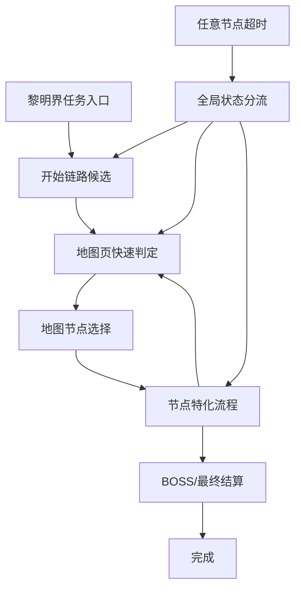

# 黎明界自动化流程设计

本文记录当前 `assets/resource/pipeline/limingjie*.json` 的状态转移设计。实现注意、模板裁剪规则和调试校验放在 `黎明界实现注意事项.md`。

## 文件拆分

黎明界 pipeline 按业务拆分为多个 JSON 文件，运行时仍通过节点名互相跳转：

- `limingjie_task.json`：入口、开始链路和全局状态分流。
- `limingjie_common.json`：角色特写、出发/公会/初始角色、通用编队/战斗、通用奖励和完成流程。
- `limingjie_map.json`：地图页判定、地图节点选择、移动确认和节点移动后目标等待。
- `limingjie_boss.json`：BOSS 节点、BOSS 战斗和 BOSS 结算流程。
- `limingjie_battle.json`：EX、NORMAL、EVENT 战斗节点和战斗后结果链。
- `limingjie_reward.json`：角色节点、遗物节点的奖励处理。
- `limingjie_shop_event.json`：商店节点和事件节点处理。

## 设计原则

- 正常链路尽量在节点自己的固定流程中闭环。
- `黎明界_全局状态分流` 只作为异常恢复入口，覆盖面要广，但不承担正常流程的每步跳转。
- 点击后如果目标页面可预期，进入特化等待；只有超时才回全局分流。
- 角色特写不做泛化识别，固定点击后只用角色加入标题判定结束。
- BOSS、商店、事件等分支有独立后置流程，不强行复用普通战斗结算链。

## 顶层状态



## 等待层级

### 全局状态分流

`黎明界_全局状态分流` 是异常恢复用的宽路由。它包含标题页、通用确认、奖励/结算关闭、商店购买确认、各类节点入口、地图页、失败/胜利、编队、战斗中、最终结算等稳定页面。

它的 `next` 列表较长，`rate_limit: 500` 用于异常恢复是合理的。正常速度优化重点不是继续降低 `rate_limit`，而是减少正常链路进入全局分流。

### 特化等待

地图节点点击后进入对应特化等待：

```text
地图选择XXX -> XXX节点移动确认OK -> XXX节点移动后目标等待 -> XXX固定链路
```

现有特化等待：

- `黎明界_角色节点移动后目标等待`
- `黎明界_EX节点移动后目标等待`
- `黎明界_NORMAL节点移动后目标等待`
- `黎明界_EVENT节点移动后目标等待`
- `黎明界_RELIC节点移动后目标等待`
- `黎明界_SHOP节点移动后目标等待`
- `黎明界_BOSS节点移动后目标等待`

通用旧节点 `黎明界_过渡目标等待` 和 `黎明界_页面关闭后目标等待` 已删除。开始链路、地图节点链路和结束链路分别维护自己的后继候选；无法确定后继的通用确认类节点直接交给 `黎明界_全局状态分流`。

## 初始化流程

```text
黎明界
-> 任务页入口 / 主页进入任务页
-> 出发Bonus关闭 / 通用确认 / 第二层出发 / 选择同行公会 / 初始角色选择 / 地图页快速判定
-> 初始角色确认
-> 角色特写继续
-> 角色特写后角色加入关闭
-> 地图页快速判定 / 奖励选择 / 结算候选
```

初始角色选择默认点前三个候选，再点确认。确认后如果进入角色特写，点击坐标使用 `[640, 240]`，避开地图节点和底部按钮。

## 地图调度

地图页由 `黎明界_地图页快速判定` 进入节点选择。当前节点类型：

- 角色节点
- EX 节点
- NORMAL 节点
- EVENT 节点
- RELIC 遗物节点
- SHOP 商店节点
- BOSS 节点

地图节点模板只使用高亮可点击态。非高亮模板仅作反例和调试参考。

## 角色节点

```text
地图选择角色
-> 角色节点移动确认OK
-> 角色节点移动后目标等待
-> 角色奖励选择
-> 角色节点物品获得关闭
-> 角色节点角色特写1
-> 角色节点加入关闭
-> 角色节点地图转移等待
-> 地图页快速判定
```

角色节点会连续获得多个角色时，特写点击与角色加入标题判定在本链路内循环处理，不回全局分流。

## EX 节点

```text
地图选择EX
-> EX节点移动确认OK
-> EX节点移动后目标等待
-> EX战斗节点预览
-> EX队伍编成
-> EX队伍战斗开始
-> EX战斗SET检查
-> EX战斗结果等待
-> EX战斗胜利继续
-> EX胜利获得物品继续
-> EX物品获得选择
-> EX物品获得关闭
-> EX角色加入选择
-> EX角色特写点击
-> EX角色加入关闭
-> EX地图转移等待
-> 地图页快速判定
```

## NORMAL 节点

```text
地图选择NORMAL
-> NORMAL节点移动确认OK
-> NORMAL节点移动后目标等待
-> NORMAL战斗节点预览
-> NORMAL队伍编成
-> NORMAL队伍战斗开始
-> NORMAL战斗SET检查
-> NORMAL战斗结果等待
-> NORMAL战斗胜利继续
-> NORMAL胜利获得物品继续
-> NORMAL角色加入选择
-> NORMAL角色特写点击
-> NORMAL角色加入关闭
-> NORMAL地图转移等待
-> 地图页快速判定
```

NORMAL 相比 EX 少 `物品获得选择 -> 物品获得关闭`。

## EVENT 节点

```text
地图选择EVENT
-> EVENT节点移动确认OK
-> EVENT节点移动后目标等待
-> EVENT事件选择
```

事件选择后目前支持：

```text
EVENT物品获得关闭 -> EVENT地图转移等待 -> 地图页快速判定
EVENT角色特写点击 -> EVENT角色加入关闭 -> EVENT地图转移等待 -> 地图页快速判定
EVENT_NORMAL战斗节点预览 -> EVENT_NORMAL队伍编成 -> 战斗 -> EVENT战斗后结算
EVENT_EX战斗节点预览 -> EVENT_EX队伍编成 -> 战斗 -> EVENT战斗后结算
```

事件后续分支变化较多，新增分支应优先接在 EVENT 链路内，超时再交给全局分流。

## RELIC 遗物节点

```text
地图选择RELIC
-> RELIC节点移动确认OK
-> RELIC节点移动后目标等待
-> RELIC物品获得选择
-> RELIC物品获得关闭
-> RELIC地图转移等待
-> 地图页快速判定
```

## SHOP 商店节点

商店主流程：

```text
地图选择SHOP
-> SHOP节点移动确认OK
-> SHOP节点移动后目标等待
-> SHOP商店处理
-> SHOP购买确认OK / SHOP购买完成OK 循环
-> SHOP购买不足停止购买
-> SHOP商店关闭
-> SHOP商店离开确认
-> SHOP地图转移等待
-> 地图页快速判定
```

购买逻辑固定点击第一个购买按钮位置。购买完成后商品会向前填充，因此循环同一位置即可。货币不足 toast 命中后停止购买并离开商店。

如果购买结果触发角色特写：

```text
SHOP购买角色特写点击
-> SHOP购买角色加入关闭
-> SHOP商店处理
```

## BOSS 节点

```text
地图选择BOSS
-> BOSS节点移动确认OK
-> BOSS节点移动后目标等待
-> BOSS战斗节点预览
-> BOSS队伍编成1
-> BOSS队伍1切换队伍2
-> BOSS队伍编成2
-> BOSS队伍2切换队伍3
-> BOSS队伍编成3
-> BOSS队伍战斗开始
-> BOSS战斗SET检查
-> BOSS战斗结果等待
-> BOSS战斗胜利继续
-> BOSS胜利获得物品继续
-> BOSS结算加入角色继续
-> BOSS结算分数关闭
-> BOSS宝箱开封关闭
-> BOSS最终物品获得关闭
-> 完成
```

BOSS 预览页使用 `boss_battle_preview_title.png`，不使用通用挑战按钮作为入口，避免异常分流时被 EX/NORMAL 战斗预览误命中。

## 战斗公共模式

EX、NORMAL、EVENT、BOSS 的战斗中段保持同一模式，但节点不强行复用：

```text
战斗节点预览
-> 队伍编成
-> 队伍战斗开始
-> 战斗SET检查
-> 战斗结果等待
-> 战斗胜利继续
-> 各自后置结算链
```

可复用的是模板和参数，例如 `party_title.png`、`party_battle_start_button.png`、`battle_set_white_button.png`、`ex_win_next_button.png`。不复用同一组节点，是因为各类型胜利后的结算链不同。

## 角色特写公共模式

所有角色特写统一使用同一种处理模式：

```text
角色特写点击 [640, 240]
-> 角色特写后角色加入关闭
-> 未识别到 character_join_title.png 则回到角色特写点击
```

不同来源只保留各自的后继出口。例如 EX 关闭后进入 `EX地图转移等待`，SHOP 关闭后回到购买循环，通用初始/奖励特写关闭后进入地图、奖励或结算候选。特写点击坐标统一使用 `[640, 240]`。

## 结束流程

普通最终结算：

```text
最终胜利继续
-> 角色奖励特写继续
-> RESULT继续
-> 结算奖励关闭
-> 完成
```

BOSS 结束流程独立，见 BOSS 节点。

## 待补

- `CLEAR` 已清除节点模板。
- 标题页 `Touch To Start` 模板化，替代 OCR 恢复。
