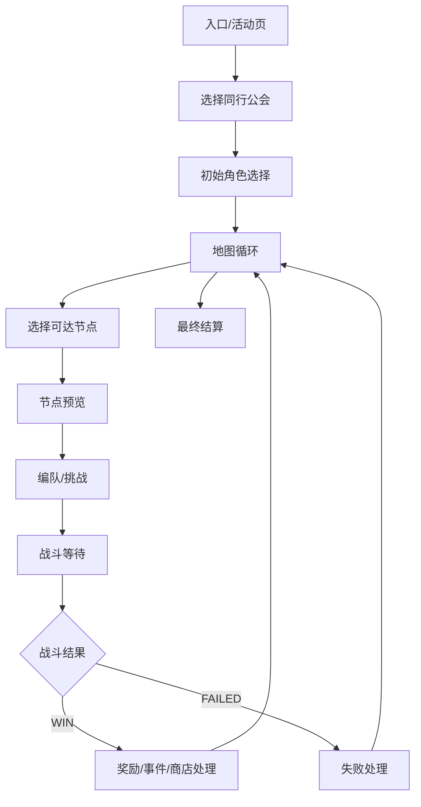

# 黎明界自动化流程设计

本文根据录像 `PrincessConnectRedive(2).mp4` 整理黎明界基础自动化流程，用于后续拆分 pipeline、补充截图模板和迭代策略规则。

录像信息：

- 分辨率：1280x720
- 帧率：约 30 FPS
- 时长：约 39:08
- 主要服务器界面：日服
- 临时抽帧目录：`debug/limingjie_video_analysis`

## 分析范围

本次只提取自动化的基础闭环，排除以下额外因素对主流程的影响：

- 连接超时或重登：约 `02:20` 出现标题页，约 `03:00` 回到黎明界地图。该段应归入异常恢复，不作为正常流程节点。
- 高难敌人失败和手动重试：约 `12:30`、`30:20`、`33:40` 附近出现失败、伤害报告、重新编队和重试。该段应归入失败处理和策略分支，不作为第一版稳定闭环的必需路径。
- 长时间自动战斗：战斗内操作暂按黑盒处理，只等待 `WIN`、`FAILED`、战斗超时或异常弹窗。

## 基础闭环

黎明界可以先抽象为下面的状态机：

第一版建议只实现 `WIN` 主线：进入黎明界、推进可达节点、战斗、领取奖励、处理商店/事件、最终结算退出。

## 关键界面与时间点

| 时间点 | 界面 | 自动化意义 |
| --- | --- | --- |
| `00:00` | 游戏主界面 | 可作为入口前置状态。 |
| `00:10` | 选择同行公会 | 选择本轮同行公会，右上角有难易度与跳过按钮。 |
| `00:30` | 角色选择 | 初始招募角色，显示 `2/3` 选择进度，右下角为确认招募按钮。 |
| `01:00` | 地图界面 | 主循环界面，显示区域进度、货币、宝箱、当前节点和可达节点。 |
| `01:30` | 角色加入奖励 | 三选一角色奖励，按钮均为 `选择する`。 |
| `01:50`、`02:10` | 道具/符号获取机会 | 三选一道具，可能连续选择多次，标题显示剩余次数。 |
| `06:50` | 战斗节点预览 | 显示敌方、奖励、`地图を見る` 和 `挑戦する`。 |
| `07:30`、`20:20`、`26:50`、`37:30` | 商店 | 商品列表、购买按钮、关闭按钮和购买确认弹窗。 |
| `12:30`、`30:20` | 战斗失败 | 第一版作为异常分支记录，不参与基础闭环。 |
| `20:10`、`26:30` | 节点清算/传送动画 | 清完节点后回地图，需等待动画结束。 |
| `24:50`、`28:10` | 事件节点 | 事件对话或选项，通常有单个 `选择する` 按钮。 |
| `38:40` | 最终胜利列表 | 本轮队伍结果页，点击右下角继续。 |
| `38:50` | RESULT 分数页 | 显示总分和路线记录，继续进入奖励结算。 |
| `39:00` | 奖励结算页 | 领取本轮报酬，流程结束。 |

## 地图循环观察

地图是黎明界自动化的核心调度界面。录像中可见：

- 顶部显示当前区域，例如 `エリア 1/5`、`3/5`、`5/5`。
- 顶部路线条显示当前小节、Boss 节点和区域进度。
- 右上角有 `MENU`，旁边显示货币或资源数量。
- 左下角显示当前角色数、遗物数和属性/状态图标。
- 地图节点类型至少包括：
  - `NORMAL`
  - `BOSS`
  - `EVENT`
  - `SHOP`
  - 高难/特殊节点，例如 `EXTREME`
  - 已清除节点 `CLEAR`
- 点击可达节点后进入节点预览，战斗节点再进入挑战/编队/战斗。

第一版路线策略可以简化为：优先点击当前可达且未清除的节点，若出现多个可选节点，则按配置优先级选择。

## 节点处理流程

### 战斗节点

录像中战斗节点通常经历：

1. 地图点击节点。
2. 进入敌人预览页。
3. 点击 `挑戦する`。
4. 可能进入编队页，也可能直接进入战斗。
5. 战斗中开启 Auto/倍速后等待。
6. 识别 `WIN` 或 `FAILED`。
7. 胜利后进入掉落、角色奖励、道具奖励或回地图。

第一版可以不做战斗内释放技能策略，只保证：

- 若 Auto/倍速未开启，则点击右侧 `AUTO` 和加速按钮。
- 识别 `WIN` 后继续。
- 识别 `FAILED` 后进入失败处理，不无限重试。

### 角色奖励

角色奖励界面为三选一，标题类似 `キャラ加入ボーナス`。基础策略：

- 有角色优先级配置时，按角色名或头像模板选择。
- 无配置时，默认选择左侧第一项。
- 选择后等待回地图或进入下一奖励界面。

### 道具/符号奖励

道具奖励界面为三选一，标题类似 `アイテム獲得チャンス`，可能存在剩余次数提示。基础策略：

- 有道具优先级配置时，按文字 OCR 或图标模板选择。
- 无配置时，默认选择左侧第一项。
- 处理连续奖励时，循环直到不再出现奖励选择界面。

### 商店节点

商店界面显示多格商品、货币、购买按钮和关闭按钮。录像中存在购买确认弹窗和离开商店确认弹窗。

第一版可选两种策略：

- 保守模式：不购买，直接关闭商店并确认离开。
- 配置模式：按道具优先级和剩余货币购买，再关闭商店。

### 事件节点

事件节点通常出现剧情背景、角色对话和一个选择按钮。基础策略：

- 识别 `イベント発生` 或事件选项界面。
- 点击可用的 `選択する`。
- 若出现奖励弹窗，关闭后回地图。

## 异常与恢复

### 连接超时/重登

录像约 `02:20` 出现标题页，之后加载并回到地图。该分支建议实现为全局恢复：

1. 任意节点超时后检查是否在标题页或 `Touch To Start`。
2. 点击进入游戏。
3. 等待加载、公告或弹窗。
4. 识别黎明界地图后恢复地图循环。

### 战斗失败/重试

录像中高难敌人失败后会进入伤害报告、菜单、编队和重试。第一版建议：

- 识别 `FAILED` 后记录失败。
- 点击可返回地图或确认的按钮。
- 可配置：
  - 失败后停止任务。
  - 失败后返回地图改走其他节点。
  - 失败后进入重试策略。

重试策略不建议第一版强做，因为它依赖角色池、EX 装备、遗物和敌方机制。

### 编队页

录像中多次出现 `パーティ編成` 和 EX 装备配置页。基础闭环只需要：

- 已有默认队伍时点击 `バトル開始`。
- 缺员或战力不足时进入异常处理。

后续策略版再支持自动换人、队伍槽切换和 EX 装备调整。

## 识别素材需求

建议新增目录：

- `assets/resource/image/jp/limingjie/`
- 后续如支持台服，再补 `assets/resource/image/tw/limingjie/`

第一批模板建议覆盖：

| 类型 | 模板 |
| --- | --- |
| 入口 | 黎明界入口按钮、黎明界标题 |
| 初始选择 | 同行公会选择标题、选择按钮、难易度区域、跳过按钮 |
| 角色选择 | 角色选择标题、招募确认按钮、选择进度 |
| 地图 | 区域进度、地图标题、MENU、NORMAL、BOSS、EVENT、SHOP、CLEAR |
| 节点预览 | 敌人预览标题、`挑戦する`、`地图を見る` |
| 编队 | `パーティ編成`、`バトル開始`、取消按钮 |
| 战斗 | `AUTO`、倍速按钮、`WIN`、`FAILED`、伤害报告 |
| 奖励 | `キャラ加入ボーナス`、`アイテム獲得チャンス`、选择按钮、关闭按钮 |
| 商店 | 商店标题、购买按钮、关闭按钮、购买确认、离开确认 |
| 事件 | `イベント発生`、事件选择按钮 |
| 结算 | 最终胜利列表、`RESULT`、奖励结算页、继续/关闭按钮 |
| 恢复 | `Touch To Start`、`Now Loading`、`CONNECTING`、常见错误确认按钮 |

## Pipeline 拆分建议

建议先新增 `assets/resource/pipeline/limingjie_task.json`，按状态拆节点，而不是把完整路线写成单条线性流程。

推荐节点分组：

- `黎明界入口`
- `黎明界选择同行公会`
- `黎明界初始角色选择`
- `黎明界地图循环`
- `黎明界节点选择`
- `黎明界战斗节点预览`
- `黎明界编队确认`
- `黎明界战斗等待`
- `黎明界胜利处理`
- `黎明界失败处理`
- `黎明界角色奖励`
- `黎明界道具奖励`
- `黎明界商店处理`
- `黎明界事件处理`
- `黎明界结算处理`
- `黎明界重登恢复`

全局 `next` 优先级建议：

1. 错误弹窗、确认弹窗、标题页恢复。
2. 奖励选择和奖励领取。
3. 商店、事件、结算等非地图页面。
4. 战斗结果。
5. 战斗中等待。
6. 地图节点选择。

这样可以减少因为 `CONNECTING`、动画、弹窗叠层导致的误点。

## 策略配置项

建议后续在 `interface.json` 中暴露少量高层选项，复杂优先级放到独立配置或 pipeline 常量中。

候选选项：

- 是否启用黎明界。
- 最大挑战轮数。
- 同行公会选择策略。
- 路线策略：均衡、优先战斗、优先商店、优先事件、避开高难。
- 奖励策略：默认左选、按角色优先级、按道具优先级。
- 商店策略：不购买、只买高优先级、买到货币不足。
- 失败策略：停止、回地图、重试一次。

需要外部补充的策略资料：

- 同行公会优先级。
- 角色加入优先级和替补规则。
- 道具/符号/遗物优先级。
- 商店购买优先级。
- 高难/特殊节点是否避开。
- 不同服务器文本和图标差异。

## 第一版实现目标

建议第一版做稳定推进，不追求最优策略：

1. 从主界面进入黎明界。
2. 选择固定同行公会。
3. 初始角色默认选取或按简单优先级选取。
4. 在地图上选择可达节点。
5. 战斗节点点击挑战，进入战斗后等待结果。
6. 胜利后处理角色奖励、道具奖励、事件和商店。
7. 到达最终结算页后领取奖励并结束。
8. 遇到连接超时重登时恢复到地图。
9. 遇到战斗失败时按配置停止或回地图。

## 后续迭代方向

- 补齐模板截图并验证不同地图背景下的节点识别稳定性。
- 引入路线优先级，不再简单点击第一个可达节点。
- 引入角色和道具优先级表。
- 增加 OCR 兜底，用于识别日文道具名、角色名和事件选项。
- 支持失败后自动换队、队伍槽选择、EX 装备配置。
- 支持台服/其他服务器素材分支。
